# Fraud Detection Lakehouse — ETL de Detección de Fraude en Transacciones Bancarias
 
 


Proyecto End-to-End de Ingeniería de Datos desarrollado sobre Azure, Azure Databricks y Unity Catalog. Implementa una arquitectura Medallion (Bronze, Silver y Gold) para transformar datos de fraude bancario en un Data Mart listo para análisis en Power BI, incorporando gobernanza de datos, CI/CD y automatización mediante Workflows

Dataset fuente: Transactions Fraud Datasets (Kaggle)

## Tabla de contenidos

1. [Contexto y problema de negocio](#contexto-y-problema-de-negocio)
2. [Objetivo del proyecto](#objetivo-del-proyecto)
3. [Arquitectura general](#arquitectura-general)
4. [Stack tecnológico](#stack-tecnológico)
5. [Fuentes de datos](#fuentes-de-datos)
6. [Gobernanza de datos (Unity Catalog)](#gobernanza-de-datos-unity-catalog)
7. [Ingesta (Landing → Raw)](#ingesta-landing--raw)
8. [Procesamiento (Bronze → Silver → Gold)](#procesamiento-bronze--silver--gold)
9. [Orquestación](#orquestación)
10. [CI/CD](#cicd)
11. [Consumo de datos (Delta Sharing → Power BI)](#consumo-de-datos-delta-sharing--power-bi)
12. [Estructura del repositorio](#estructura-del-repositorio)
13. [Decisiones de diseño clave](#decisiones-de-diseño-clave)
14. [Mejoras futuras](#mejoras-futuras)

## Arquitectura general
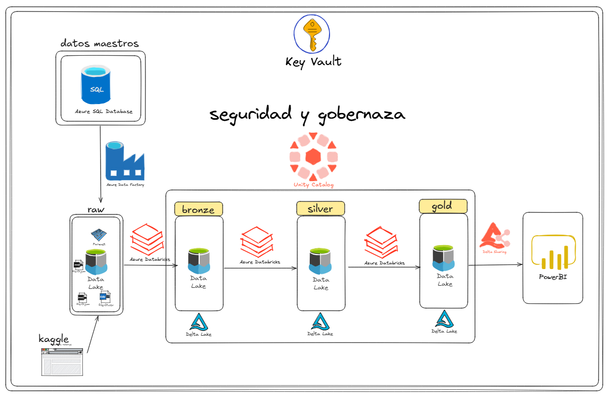

Todo el procesamiento Bronze/Silver/Gold corre sobre notebooks orquestados como Databricks Workflow, desplegados vía CI/CD desde este repositorio.


## Stack tecnológico

| Capa | Tecnología |
|---|---|
| Almacenamiento | Azure Data Lake Storage Gen2 (4 contenedores: raw, bronze, silver, gold) |
| Base de datos origen | Azure SQL Database |
| Orquestación de ingesta | Azure Data Fabric (ADF) |
| Procesamiento | Azure Databricks (PySpark, Structured Streaming, Auto Loader) |
| Gobernanza | Unity Catalog (metastore autoadministrado) |
| Formato de tablas | Delta Lake |
| Compartición de datos | Delta Sharing |
| Visualización | Power BI |
| CI/CD | GitHub Actions |
| Control de versiones | GitHub |


## Fuentes de datos

| Archivo/tabla | Origen | Formato en Raw | Descripción |
|---|---|---|---|
| `transactions_data.csv` | Kaggle → Landing → ADF | CSV | ~1.5 GB, detalle de transacciones |
| `mcc_codes.json` | Kaggle → Landing → ADF | JSON (objeto tipo diccionario) | Catálogo de categorías de comercio |
| `train_fraud_labels.json` | Kaggle → Landing → ADF | JSON anidado (`{"target": {...}}`) | Etiquetas de fraude por transacción |
| `users_data` | Azure SQL (previamente limpiado de símbolos `$`) | Parquet | Perfil demográfico y financiero de clientes |
| `cards_data` | Azure SQL (previamente limpiado de símbolos `$`) | Parquet | Detalle de tarjetas emitidas |

## Gobernanza de datos (Unity Catalog)

- **Metastore autoadministrado**: se eliminó el metastore por defecto del workspace y se creó uno propio (`uc-metastore`), respaldado en un contenedor dedicado del Data Lake.
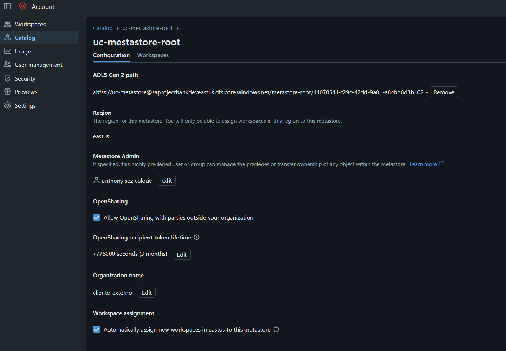
- **Storage credentials + External locations**: se crearon credenciales de acceso (Access Connector) y un external location por cada uno de los 4 contenedores (`raw`, `bronze`, `silver`, `gold`).
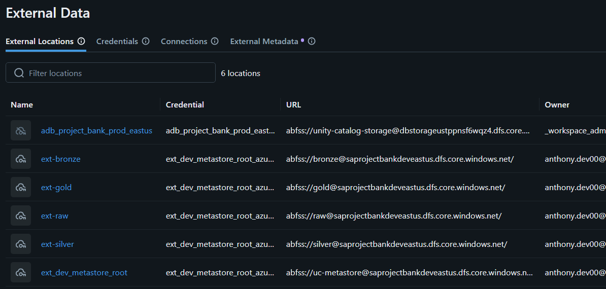
- **Catálogo del proyecto**: `bank_dev`, con 3 esquemas (`bronze`, `silver`, `gold`), cada uno con `MANAGED LOCATION` apuntando a su contenedor dedicado — separación física real entre capas, no solo lógica.
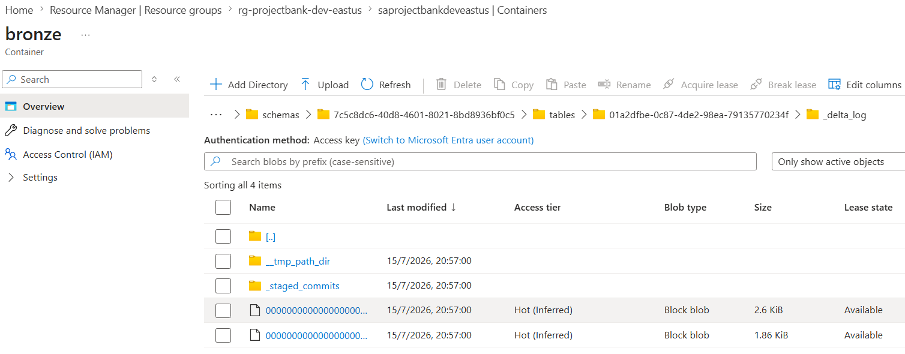
- **Tipo de tablas**: managed Delta en las 3 capas — se evaluó external tables para Bronze (por si se necesitaba recuperar datos ante un `DROP` accidental), pero se descartó porque Raw ya funciona como fuente de verdad inmutable e independiente del catálogo; Bronze siempre es reconstruible desde ahí. Managed tables además tienen ventana de recuperación (`UNDROP TABLE`, 7–30 días) que cubre el mismo riesgo con menor complejidad operativa.
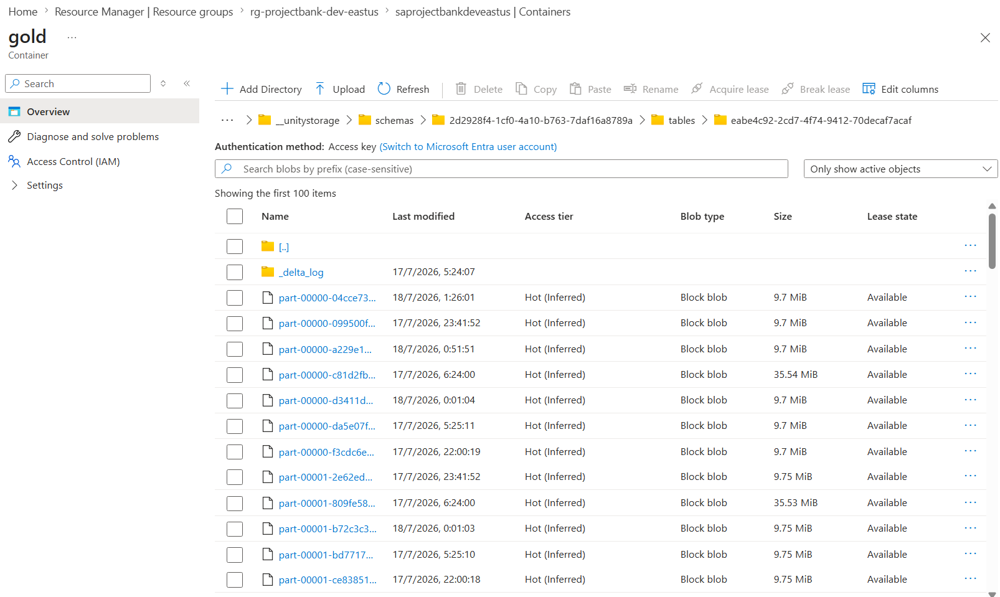
- **Control de acceso**: usuarios y grupos administrados desde Azure Account Console (Manage Account), simulando una estructura de grupos empresarial. Permisos otorgados vía `GRANT USE CATALOG`, `USE SCHEMA`, `CREATE TABLE`, `SELECT` por esquema.
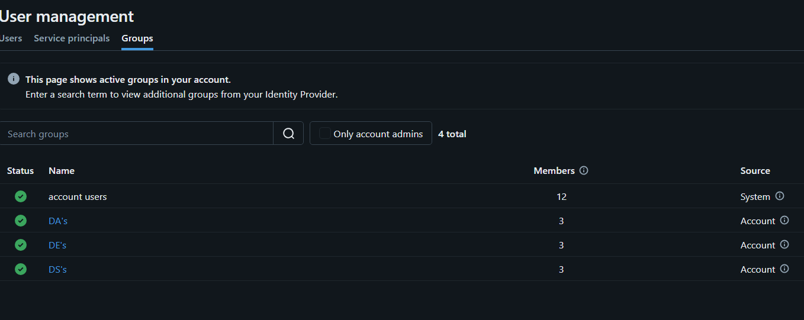


## Ingesta (Landing → Raw)

- Los 3 archivos sueltos de Kaggle se suben manualmente a un contenedor **Landing**, unificado con Raw por temas de costo (se evaluó mantenerlos separados, pero para el volumen de este proyecto no se justificaba el contenedor intermedio adicional).
- ADF copia desde Landing/Azure SQL hacia **Raw**, particionando por carpeta de origen y fecha de carga:
  ```
  raw/core_banco/cards_data/<fecha>/*.parquet
  raw/core_banco/users_data/<fecha>/*.parquet
  raw/external/transactions/<fecha>/*.csv
  raw/external/catalogos/<fecha>/{mcc_codes.json, train_fraud_labels.json}
  ```
- *(Automatización pendiente/futura)*: trigger programado en ADF para correr esta copia diariamente sin intervención manual.

## Procesamiento (Bronze → Silver → Gold)

### Bronze
- `transactions`: ingesta incremental con **Auto Loader** (`cloudFiles`, formato CSV), esquema explícito, `trigger(availableNow=True)` para ejecución tipo batch programado (no cluster 24/7).
- `cards` / `users`: mismo patrón de Auto Loader, formato parquet (ya tipado desde Azure SQL).
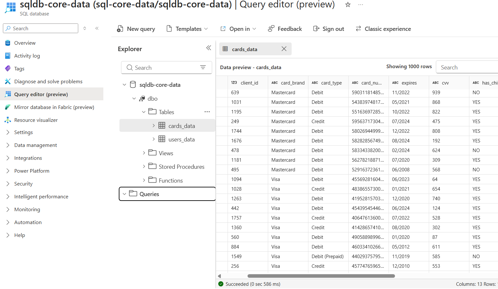
```python
  df_stream_users = (
      spark.readStream
      .format("cloudFiles")
      .option("cloudFiles.format", "parquet")
      .option("cloudFiles.schemaLocation", schema_location_users)
      .option("cloudFiles.rescuedDataColumn", "_rescued_data")
      .load(raw_users_root)
  )

  df_bronze_users = df_stream_users.withColumn("ingestion_date", F.current_timestamp())
  
  query_users = (
      df_bronze_users.writeStream
      .format("delta")
      .option("checkpointLocation", checkpoint_location_users)
      .option("mergeSchema", "true")
      .outputMode("append")
      .trigger(availableNow=True)
      .toTable(f"{catalogo}.{esquema}.users")
  )
```
- `mcc_codes` / `fraud_labels`: **no** se ingestan con Auto Loader — son objetos JSON tipo diccionario (claves dinámicas), incompatibles con inferencia de esquema tabular. Se leen en batch como texto crudo y se parsean con `from_json` + `explode` (`MAP<STRING,STRING>` y `STRUCT<target: MAP<STRING,STRING>>` respectivamente).
- Tablas con `CLUSTER BY` (liquid clustering) en vez de `PARTITIONED BY` — el dataset (1.5 GB) está muy por debajo del umbral (~1 TB) donde particionar tradicionalmente aporta valor; liquid clustering se adapta a los patrones de consulta sin gestión manual de particiones.

### Silver
- Procesamiento incremental (Structured Streaming) — Implementado mediante micro-lotes (foreachBatch) para aprovechar el control automático de archivos procesados   (checkpoints); esto garantiza una carga incremental eficiente y permite ejecutar la lógica Batch del MERGE (SCD Tipo 2) sin la complejidad del streaming en     tiempo real, para `users` / `cards`.
- Limpieza: `amount` y `credit_limit` (quitar `$`, castear a `DECIMAL`), parseo de `errors` a `tiene_error` (booleano) + `lista_errores` (array) en `transactions`.
- Validación de integridad referencial contra `users`, `cards` y `mcc_codes` (columnas `es_valida` / `motivo_invalidez`, sin descartar filas silenciosamente).
- Enriquecimiento: `client_age`, `client_gender`, `card_brand`, `mcc_description` — unidos en el mismo join usado para la validación de integridad, evitando joins redundantes.
- Escritura idempotente: `INSERT` directo en la primera carga (evita el overhead de `MERGE` contra tabla vacía), `MERGE INTO` (`whenMatchedUpdateAll` / `whenNotMatchedInsertAll`) en corridas incrementales posteriores.

### Gold
- Modelo dimensional (star schema): `fact_transactions` + `dim_users`, `dim_cards`, `dim_mcc`, `dim_date`.
- Tablas agregadas pre-calculadas para consumo directo en Power BI (tasa de fraude por MCC, por estado, por rango de edad, evolución mensual).

## Orquestación

Workflow de Databricks (ambiente de desarrollo) que encadena los notebooks de ingesta Bronze → transformación Silver → modelado Gold, parametrizado vía `dbutils.widgets` (catálogo, contenedores, rutas por tabla) para reutilizar el mismo notebook entre distintas fuentes y ambientes.
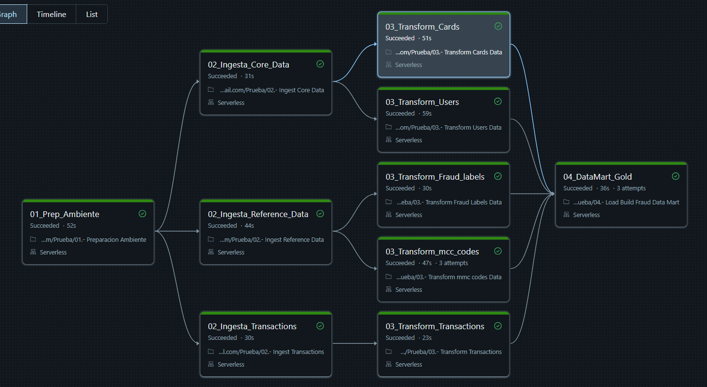

## CI/CD

Pipeline en **GitHub Actions** que despliega desde `dev` hacia el ambiente de `produccion`  siguiente:
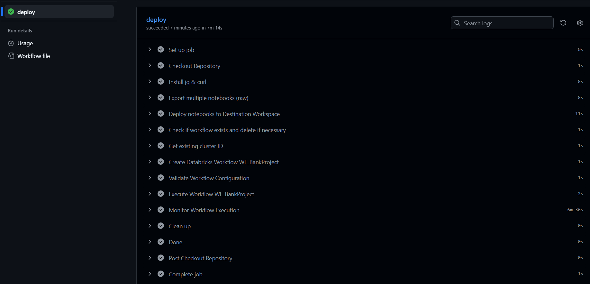
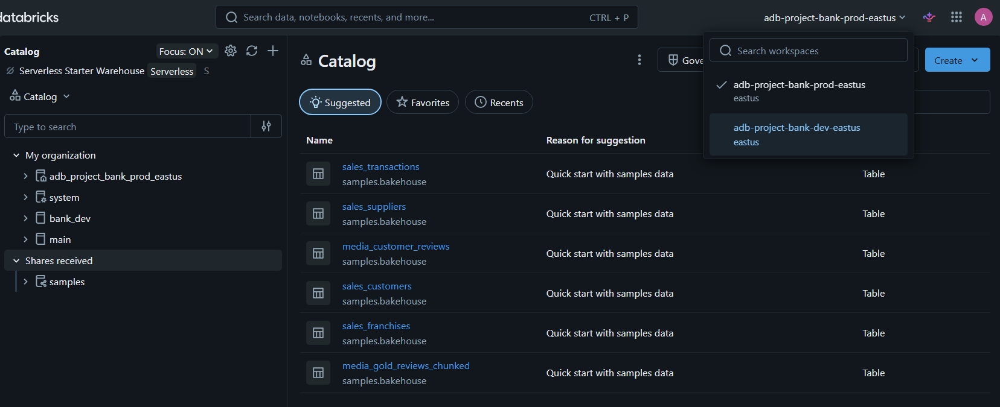
- Sincroniza los notebooks del repositorio hacia el workspace de Databricks correspondiente.
- Despliegue del Job como código: crea/actualiza la definición completa del Workflow en prod vía Databricks REST API / CLI (Jobs-as-code) — no se reconfigura el     Job manualmente en cada release, lo que evita drift entre lo que corre en dev y lo que corre en prod.
- Activación de infraestructura: enciende/valida el cluster de prod necesario antes de desplegar.
- Para hacer el pipeline resiliente, el script consulta la API para encontrar el ID dinámico del clúster en base a su nombre, evitando fallos si la infraestructura es recreada.
```python
  # 2. Validación y encendido dinámico de infraestructura
  clusters_response=$(curl -s -X GET \
    -H "Authorization: Bearer $DEST_TOKEN" \
    "$DEST_HOST/api/2.0/clusters/list")

  # Extracción dinámica del ID usando jq
  cluster_id=$(echo "$clusters_response" | \
    jq -r --arg name "$CLUSTER_NAME" '.clusters[]? | select(.cluster_name == $name) | .cluster_id')
```

## Consumo de datos (Delta Sharing → Power BI)

Las tablas Gold se exponen vía **Delta Sharing** hacia Power BI, sin duplicar datos ni exportarlos a otro almacenamiento — Power BI lee directo del share definido en Unity Catalog.
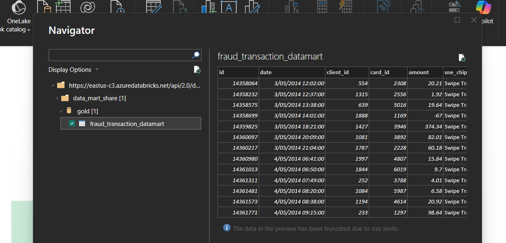
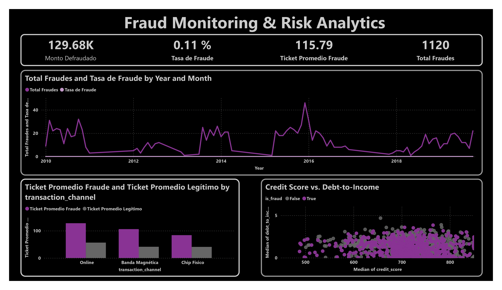

## Estructura del repositorio

```
├── notebooks/
│   ├── 01_preparacion_ambiente/      # catálogo, esquemas, grants
│   ├── 02_ingesta_bronze/            # Auto Loader por fuente
│   ├── 03_silver/                    # limpieza, validación, enriquecimiento
│   ├── 04_gold/                      # star schema y agregados
├── workflows/                        # definición de jobs/orquestación
├── .github/workflows/despliegue.yml                # pipelines de CI/CD                         
└── README.md
```

## Decisiones de diseño clave

| Decisión | Alternativa considerada | Por qué se eligió esta |
|---|---|---|
| Raw  | Raw  | Menor costo/complejidad|
| Managed tables en las 3 capas | External tables en Bronze | Raw ya es la fuente de verdad inmutable; managed tiene `UNDROP` como red de seguridad adicional |
| Liquid clustering, sin partition | `PARTITIONED BY (year, month)` | Dataset de 1.5 GB, muy por debajo del umbral donde particionar aporta valor |
| Silver en batch | Streaming con Change Data Feed | Datos llegan en lotes diarios, no en tiempo real; menor complejidad operativa |
| Insert directo en primera carga, merge después | `MERGE INTO` siempre | Evita overhead de join de Delta contra una tabla vacía |
| Enriquecimiento en Silver, no en Gold | Enriquecer solo en Gold | Silver debe ser "conformado y listo para negocio", no solo tipado |

## Mejoras futuras

- Automatizar el trigger de ADF (Landing/Azure SQL → Raw) con ejecución programada diaria.
- Filtrar incrementalmente en Silver (`WHERE ingestion_date > última fecha procesada`) en vez de releer Bronze completo en cada corrida.
- Migrar Bronze de Auto Loader manual a **Lakeflow Declarative Pipelines** si el workspace cuenta con plan Premium, para reducir boilerplate de orquestación.
- Agregar pruebas de calidad de datos automatizadas (Great Expectations o `dbt tests`) dentro del pipeline de CI/CD.


### 👤 Autor
[Anthony Criz Ccolque Quispe](https://github.com/Criz321)

